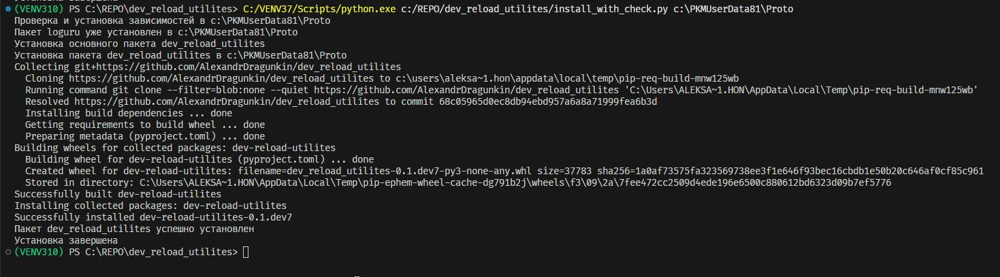

# dev_reload_utilites v0.1.0

Утилита для централизованного управления перезагрузкой модулей в приложении K3-Mebel 8.1. 
Полезно при разработке и отладке скриптов на языке python для приложения K3-Mebel 8.1. Если разработчику для применения своих изменений необходимо перезагружать приложение целиком, то этот пакет может помочь сократить время на перезагрузку приложения.

Предназначена для разработчиков, которые работают с приложением K3-Mebel 8.1. Знают что такое python и pip. Умеют вызывать установку пакета и располагают установленным на компьютер python 3.7. 32bit.

## Установка

Для установки пакета через pip, выполните следующую команду:

```bash
pip install git+https://github.com/AlexandrDragunkin/dev_reload_utilites --target c:\PKMUserData81\Proto
```
В этом случае в папку будут установлены зависимости `loguru` и `colorama`. Что бы избежать возможного дублирования пакетов, можно установить пакет другой командой:


```bash
C:/VENV37/Scripts/python.exe install_with_check.py "c:\\PKMUserData81\\Proto"
```
Если всё нормально, то вы увидите такой вывод в терминале:

<details>
  <summary>Результат команды: Текст под спойлером</summary>
```


```
</details>

**Важно:** Обратите внимание я использую python и pip из виртуального окружения python 3.7.
3.7 это ОЧЕНЬ важно!

**Важно:** Пакет предназначен для работы с приложением K3-Mebel 8.1. 
Целевая папка для размещения файлов должна быть `UserProto`, например: `c:\PKMUserData81\Proto`

При установке пакета убедитесь, что у вас есть доступ к этой директории и что она существует.

## Описание

Этот пакет предоставляет функции для автоматической перезагрузки модулей Python и их зависимостей внутри закрытого скомпилированного пакета k3, который является частью приложения K3-Mebel 8.1 (*mebel.exe*). Приложение K3-Mebel 8.1 является самодостаточным интерпретатором Python 3.7 32bit.

## Основные функции

- `auto_reload_module`: Перезагрузка модуля и его зависимостей
- `reload_module_with_dependencies`: Перезагрузка модуля и зависимых от него модулей
- `selective_reload`: Перезагрузка модулей по префиксу имени

## Классы для работы с диалогами

- `SetVar`: Основной класс для создания диалоговых окон
- `Title`: Титульная часть диалога
- `WString`: Виджет для ввода строк

## Пример использования

```python
from dev_reload_utilites.auto_reload_manager import auto_reload_module

# Перезагрузить модуль и все его зависимости
auto_reload_module('my_module')
```

## Графический интерфейс

При запуске модуля как скрипта (python auto_reload_manager.py) отображается диалоговое окно для выбора модуля и функции перезагрузки:


В диалоговом окне можно выбрать:
- Имя модуля для перезагрузки (из списка недавно редактированных файлов). По умолчанию выбирается самый "молодой" модуль из списка.
- Функцию перезагрузки (auto_reload_module, reload_module_with_dependencies, selective_reload). Рекомендуется использовать auto_reload_module.

## Зависимости

- Python 3.7
- K3-Mebel 8.0+ Лучше 8.1