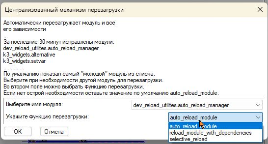

# dev_reload_utilites v0.1.0

:::{figure} ./Pictures/kuysnym.jpg
:align: left
:width: 40%
:::

Утилита для **централизованного управления перезагрузкой модулей в приложении K3-Mebel 8.1**. 
Полезно при разработке и отладке скриптов на языке python для приложения **K3-Mebel 8.1**. Если разработчику для применения своих изменений <u>необходимо перезагружать приложение целиком</u>, то этот пакет может помочь сократить время на перезагрузку приложения.

<u>Предназначена для разработчиков</u>, которые:

 - работают с приложением **K3-Mebel 8.1**. 
 - Знают что такое `python` и `pip`. 
 - Умеют вызывать установку пакета и располагают установленным на компьютер python 3.7. 32bit.

## Установка

Для установки пакета через `pip`, выполните следующую команду:

```bash
pip install git+https://github.com/AlexandrDragunkin/dev_reload_utilites --target c:\PKMUserData81\Proto
```

В этом случае в папку будут установлены зависимости `loguru` и `colorama`. Что бы избежать <u>возможного дублирования пакетов</u>, можно **установить пакет другой командой**:

Скачать файл `install_with_check.py` из репозитория можно командой в оболочке `PowerShell`:

В текущую дирректорию
```powershell
Invoke-WebRequest -Uri https://raw.githubusercontent.com/AlexandrDragunkin/dev_reload_utilites/main/install_with_check.py -OutFile install_with_check.py
```

Или в конкретную. Например в папку `c:/TEMP`

```powershell
Invoke-WebRequest -Uri "https://raw.githubusercontent.com/AlexandrDragunkin/dev_reload_utilites/main/install_with_check.py" -OutFile "c:/TEMP/install_with_check.py"

```

```bash
C:/VENV37/Scripts/python.exe install_with_check.py "c:\\PKMUserData81\\Proto"
```

Если всё нормально, то вы увидите такой вывод в терминале:

<details>

  <summary>Результат команды: Текст под спойлером</summary>


```powershell
(VENV37) PS C:\venv37\Scripts> Invoke-WebRequest -Uri "https://raw.githubusercontent.com/AlexandrDragunkin/dev_reload_utilites/main/install_with_check.py" -OutFile "c:/TEMP/install_with_check.py"
(VENV37) PS C:\venv37\Scripts> cd c:\temp
(VENV37) PS C:\temp> dir inst*


    Каталог: C:\temp


Mode                 LastWriteTime         Length Name
----                 -------------         ------ ----
-a----        28.10.2025      9:53           5585 install_with_check.py


(VENV37) PS C:\temp> python install_with_check.py c:\ARL81_UserData\Proto 
Проверка и установка зависимостей в c:\ARL81_UserData\Proto
Пакет loguru уже установлен в c:\ARL81_UserData\Proto
Установка основного пакета dev_reload_utilites
Установка пакета dev_reload_utilites в c:\ARL81_UserData\Proto
Collecting git+https://github.com/AlexandrDragunkin/dev_reload_utilites
  Cloning https://github.com/AlexandrDragunkin/dev_reload_utilites to c:\users\aleksa~1.hon\appdata\local\temp\pip-req-build-lwjbz9o7
  Running command git clone --filter=blob:none --quiet https://github.com/AlexandrDragunkin/dev_reload_utilites 'C:\Users\ALEKSA~1.HON\AppData\Local\Temp\pip-req-build-lwjbz9o7'
  Resolved https://github.com/AlexandrDragunkin/dev_reload_utilites to commit 206812887134f619167dc73cfd0f5b61e52eb75d
  Installing build dependencies ... done
  Getting requirements to build wheel ... done
  Preparing metadata (pyproject.toml) ... done
Building wheels for collected packages: dev-reload-utilites
  Building wheel for dev-reload-utilites (pyproject.toml) ... done
  Created wheel for dev-reload-utilites: filename=dev_reload_utilites-0.1.dev12-py3-none-any.whl size=38490 sha256=6be92e2619f7d686335f616cd5f4b7e0659cbf382199922ad35b8a523d476d51        
  Stored in directory: C:\Users\ALEKSA~1.HON\AppData\Local\Temp\pip-ephem-wheel-cache-g4ikb7r7\wheels\f3\09\2a\7fee472cc2509d4ede196e6500c880612bd6323d09b7ef5776
Successfully built dev-reload-utilites
Installing collected packages: dev-reload-utilites
Successfully installed dev-reload-utilites-0.1.dev12
Пакет dev_reload_utilites успешно установлен
Установка завершена
(VENV37) PS C:\temp> 
```

</details>

**Важно:** Обратите внимание я использую python и pip из виртуального окружения python 3.7.
3.7 это ОЧЕНЬ важно!

**Важно:** Пакет предназначен для работы с приложением K3-Mebel 8.1.
Целевая папка для размещения файлов должна быть `UserProto`, например: `c:\PKMUserData81\Proto`

При установке пакета убедитесь, что у вас есть доступ к этой директории и что она существует.

## Описание

Этот пакет предоставляет функции для автоматической перезагрузки модулей Python и их зависимостей внутри закрытого скомпилированного пакета k3, который является частью приложения K3-Mebel 8.1 (*mebel.exe*). Приложение K3-Mebel 8.1 является самодостаточным интерпретатором Python 3.7 32bit.

## Основные функции

- `auto_reload_module`: Перезагрузка модуля и его зависимостей
- `reload_module_with_dependencies`: Перезагрузка модуля и зависимых от него модулей
- `selective_reload`: Перезагрузка модулей по префиксу имени

## Классы для работы с диалогами

- `SetVar`: Основной класс для создания диалоговых окон
- `Title`: Титульная часть диалога
- `WString`: Виджет для ввода строк

## Пример использования

```python
from dev_reload_utilites.auto_reload_manager import auto_reload_module

# Перезагрузить модуль и все его зависимости
auto_reload_module('my_module')
```

Можно назначить на кнопку команду пользователя в редакторе интерфейса к3мебель

```bash
;macro mpathexpand("<userProto>\\dev_reload_utilites\\auto_reload_manager.py");
```

## Графический интерфейс

При запуске модуля как скрипта (python auto_reload_manager.py) отображается диалоговое окно для выбора модуля и функции перезагрузки:



В диалоговом окне можно выбрать:

- Имя модуля для перезагрузки (из списка недавно редактированных файлов). По умолчанию выбирается самый "молодой" модуль из списка.
- Функцию перезагрузки (auto_reload_module, reload_module_with_dependencies, selective_reload). Рекомендуется использовать auto_reload_module.

## Зависимости

- Python 3.7
- K3-Mebel 8.0+ Лучше 8.1
